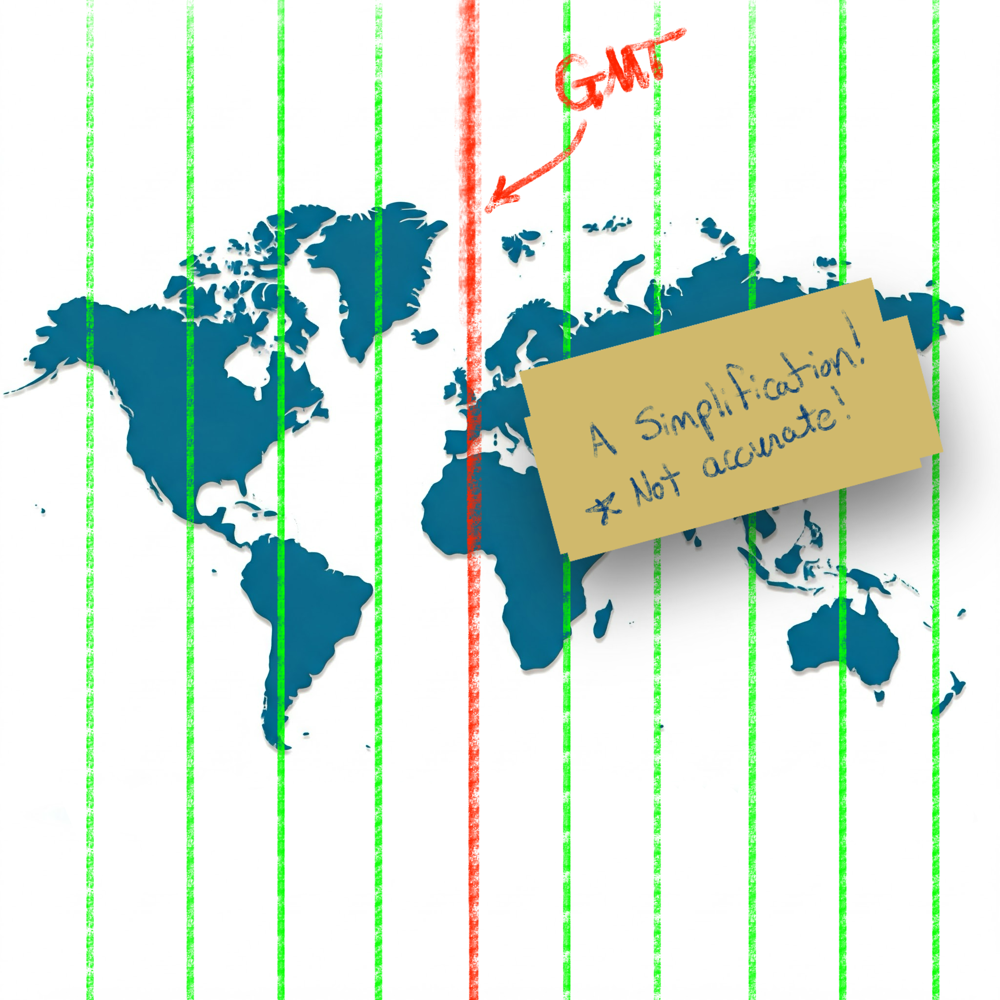

# Time Zones and Offsets and ObjectScript, Oh My!

## Your Mission

Let's pretend for a moment that you're an international action spy who's dedicated your life to keeping the people of the world safe from danger.  You recieve the following mission:

> Good day, Agent IRIS,
>
>  We're sorry for interrupting your vacation in the `Bahamas`, but we just received word from our `London` agent that a "time bomb" is set to detonate in a highly populated area in `Los Angeles`.  Our sources say that the "time bomb" is set to trigger at `3:14 PM` this afternoon.
>
> Hurry, the people are counting on you! 

### The Problem
You rush to your feet and get ready to head to Los Angeles, but you quickly realize that you're missing a key piece of information; will the "time bomb" trigger at `3:14 PM Bahama-time` or at `3:14 PM Los Angeles-time`?  ...or maybe even `3:14 PM London-time`.

You quickly realize that the time you were provided (`3:14 PM`) does not give you enough information to determine when you need to be in `Los Angeles`.

The time you were provided (`3:14 PM`) was __ambiguous__.  You need more information to determine an __exact__ time.

### Some Solutions
As you think over the problem, you realize there are methods of overcoming the ambiguity of time that you were provided:

1. Your source could have provided the location to which the local time was `3:14 PM`.  For instance, `Los Angeles`, `Bahamas`, or `London`.

2. Your source could have used a standard such as UTC (Coordinated Universal Time) to provide you an offset from an agreed-upon location (such as Greenwich, London).

### The Happy Ending
You call your source and confirm that the time provided was indeed `3:14 PM Los Angeles-time`.  You are able to travel to Los Angeles, disarm the "time bomb" before `3:14 PM`, and quickly return to the Bahamas to finish your vacation.


### The Point
So, what is the point of this thought exercise?  I doubt that any of us will encounter the problem presented above, but if you work with an application or code that moves data from one location to another (especially if the locations are in different time zones), you __need to be aware__ of how to handle datetimes and time zones.

## Time Zones are HARD!
Well, time zones aren't so bad.  Daylight savings time and political boundaries make time zones difficult.

I thought I always understood the "general" idea of time zones: the planet is split into vertical slices by time zone, where each time zone is one hour behind the time zone to the East.



While this simplification holds for many locations, unfortunately there are many [exceptions](https://www.worldtimeserver.com/learn/unusual-time-zones/) to this rule.

")
Reference: [Time zones of the world (Wikipedia)](https://en.wikipedia.org/wiki/Time_zone)


## Standardizing with UTC (the "Origin")

To simplify the language of conveying specific times, the world has settled on using [UTC (Coordinated Universal Time)](https://en.wikipedia.org/wiki/Coordinated_Universal_Time).  This standard sets the "origin" to the 0° longitude that goes through [Greenwich, London](https://en.wikipedia.org/wiki/Greenwich_Mean_Time).

### Defining "Offset"
Using UTC as the basis, all other time zones can be defined relative to UTC.  This relationship is referred to as the __UTC offset__.

If you have a local time and an offset, you no longer have an ambiguous time (as seen in our spy example above); you have a definite and specific time with no ambiguity.

The typical format used to show the UTC offset is `±HHMM[SS[.ffffff]]`.
- A minus `-` sign indicates an offset to the West of UTC.
- A plus `+` sign indicates an offset to the East of UTC.
- `HH` indicates hours (zero-padded)
- `MM` indicates minutes (zero-padded)
- `SS` indicates seconds (zero-padded)
- `.ffffff` indicates fractional seconds

For example, in America, the Eastern Standard Zime Zone (EST) is defined as `-0500` UTC.  This means that all locations in EST are 5 hours behind UTC.  If the time is `9:00 PM` at UTC, then the local time in EST is `4:00 PM`.

In the Australian Central Western Standard Time Zone (ACWST), the offset is defined as `+0845` UTC.  If the time is `1:00 AM` at UTC, then the local time in ACWST is `9:45 AM`.

## Daylight Savings Time
So, back to the time zone maps above.  From the image, you can see that many time zones follow the political boundaries of countries and regions.  This complicates time zone calculations slightly, but it is easy enough to wrap your mind around.

Unfortunately, there is one more factor to consider when working with times and time zones.

Let's look at `Los Angeles`.

On the map, the UTC offset for `Los Angeles` is `-8` in __Standard Time__.  Standard Time is typically followed during the winter months, whereas __Daylight Savings Time__ is typically followed during the summer months.

[Daylight Savings Time (DST)](https://en.wikipedia.org/wiki/Daylight_saving_time) advances the clocks in a give time zone forward (typically by one hour).  There are several reasons that political regions might choose to follow DST (such as energy savings, better use of daylight, etc.).  The difficulty and complexity of Daylight Savings Time is that DST is not consistently followed around the world.  Depending on your location, your region may or may not follow DST.

## Time Zone Database

Since the combination of political boundaries and Daylight Savings Time greatly increases the complexity of determining a specific time, a time zone database is needed to correctly map local times to specific times relative to UTC.  [The Internet Assigned Numbers Authority (IANA) Time Zone Database](https://www.iana.org/time-zones) is the common source of time zone information used by operating systems and programming languages.

The database includes the names and alias of all time zones, information about the offset, information about the use of Daylight Savings Time, time zone abbreviations, and which date ranges the various rules apply.

Copies of and information about the time zone database can be found on [IANA's website](https://www.iana.org/time-zones).

Most UNIX systems have a copy of the database that gets updated with the operating system's package manager (typically installed in `/usr/share/zoneinfo`).  Some programming languages have the database built-in.  Others make it available by a library or can read the system's copy of the database.

### Time Zone Names/Identifiers

The time zone database [contains many names and aliases](https://en.wikipedia.org/wiki/List_of_tz_database_time_zones#) for specific time zones.  Many of the entries include a country (or conteninent) and major city in the name.  For example:
- America/New_York
- America/Los_Angeles
- Europe/Rome
- Australia/Melbourne

## Conversion and Formatting Using ObjectScript

So, now we know about:
- Local times (ambiguous times without an offset or location)
- UTC offsets (the relative offset a timestamp or location is from the UTC "origin" in Greenwich, London)
- Daylight Savings Time (an attempt at helping civilization at the expense of time zone offsets)
- Time zone database (which includes information about time zones and Daylight Savings observance in many locations and regions)

Knowing this, how do we work with datetimes/time zones in ObjectScript?

***Note: I believe all the following statements are true about ObjectScript, but please let me know if I misstate how ObjectScript works with time zones and offsets.

### Built-in Variables and Functions

If you need to convert timestamps between various formats within the system time zone of process running IRIS, the built-in features of ObjectScript should be sufficient.  Here is a brief listing of various time-related variables/functions in ObjectScript:

- $ZTIMESTAMP / $ZTS
  - IRIS Internal format as a UTC value (offset +0000).
  - Format: ddddd,sssss.fffffff

- $NOW(tzmins)
  - Current system local time with the given `tzmins` offset from UTC.
  - Does not take Daylight Savings Time into account.
  - By default, tzmins is based off of the $ZTIMEZONE variable.
  - Format: ddddd,sssss.fffffff

- $HOROLOG
  - Current system local time (based on $ZTIMEZONE), taking Daylight Savings Time into account.
  - Format: ddddd,sssss.fffffff

- $ZTIMEZONE
  - Returns or sets the system's local UTC offset in minutes.

- $ZDATETIME() / $ZDT()
  - Converts $HOROLOG format to a specific display format.
  - Can be used to convert from system local time to UTC (+0000).

- $ZDATETIMEH() / $ZDTH()
  - Converts a datetime string to internal $HOROLOG format.
  - Can be used to convert from UTC (+0000) to system local time.

As best as I can tell, these functions are only able to manipulate datetimes using the time zone of the local system.  There does not appear to be a way to work with arbitrary time zones in ObjectScript.

### Enter the tz Library on Open Exchange

To accommodate conversion to and from arbitrary time zones, I worked to create the [tz - ObjectScript Time Zone Conversion Library](https://openexchange.intersystems.com/package/tz---ObjectScript-Time-Zone-Conversion-Library).

This library accesses the time zone database installed on your system to provide support for converting timestamps between time zones and formats.

For instance, if you have time local to Los Angeles (America/Los_Angeles), you can convert it to the time zone used in the Bahamas (America/New_York) or the time zone used in London (Europe/London):

```cls
USER>zw ##class(tz.Ens).TZ("2024-12-20 3:14 PM", "America/Los_Angeles", "America/New_York")
"2024-12-20 06:14 PM"

USER>zw ##class(tz.Ens).TZ("2024-12-20 3:14 PM", "America/Los_Angeles", "Europe/London")
"2024-12-20 11:14 PM"
```

If you are given a timestamp with an offset, you can convert it to the local time in Eucla, Australia (Australia/Eucla), even if you don't know the original time zone:

```cls
USER>zw ##class(tz.Ens).TZ("2024-12-20 08:00 PM -0500", "Australia/Eucla")
"2024-12-21 09:45 AM +0845"
```

If you work with HL7 messages, the `tz` library has several methods exposed to Interoperability Rules and DTLs to help you easily convert between time zones, local times, times with offsets, etc.:

```cls
// Convert local time from one time zone to another 	 
set datetime = "20240102033045"
set newDatetime = ##class(tz.Ens).TZ(datetime,"America/New_York","America/Chicago")

// Convert local time to offset 	 
set datetime = "20240102033045"
set newDatetime = ##class(tz.Ens).TZOffset(datetime,"America/Chicago","America/New_York")

// Convert offset to local time 	 
set datetime = "20240102033045-0500"
set newDatetime = ##class(tz.Ens).TZLocal(datetime,"America/Chicago")

// Convert to a non-HL7 format 	 
set datetime = "20240102033045-0500"
set newDatetime = ##class(tz.Ens).TZ(datetime,"America/Chicago",,"%m/%d/%Y %H:%M:%S %z")
```

## Summary

I appreciate you following me on this "international journey" where we encountered time zones, Daylight Savings Time, world maps, and "time bombs".  Hopefully, this was able to shed some light on (and simplify) many of the complexities of working with datetimes and time zones.

Check out [tz - ObjectScript Time Zone Conversion Library](https://openexchange.intersystems.com/package/tz---ObjectScript-Time-Zone-Conversion-Library) and let me know if you have any questions (or corrections/clarifications to something I said).

Thanks!

## References/Interesting Links
- https://en.wikipedia.org/wiki/Coordinated_Universal_Time
- https://en.wikipedia.org/wiki/Time_zone
- https://en.wikipedia.org/wiki/Daylight_saving_time
- https://www.worldtimeserver.com/learn/unusual-time-zones/
- https://www.worldtimeserver.com/learn/history-of-time-zones/
- https://www.worldtimeserver.com/learn/what-is-a-time-zone/
- https://en.wikipedia.org/wiki/Tz_database
- https://en.wikipedia.org/wiki/List_of_tz_database_time_zones
- https://en.wikipedia.org/wiki/Internet_Assigned_Numbers_Authority
- https://www.iana.org/time-zones
- https://www.gnu.org/software/libc/manual/html_node/Calendar-Time.html